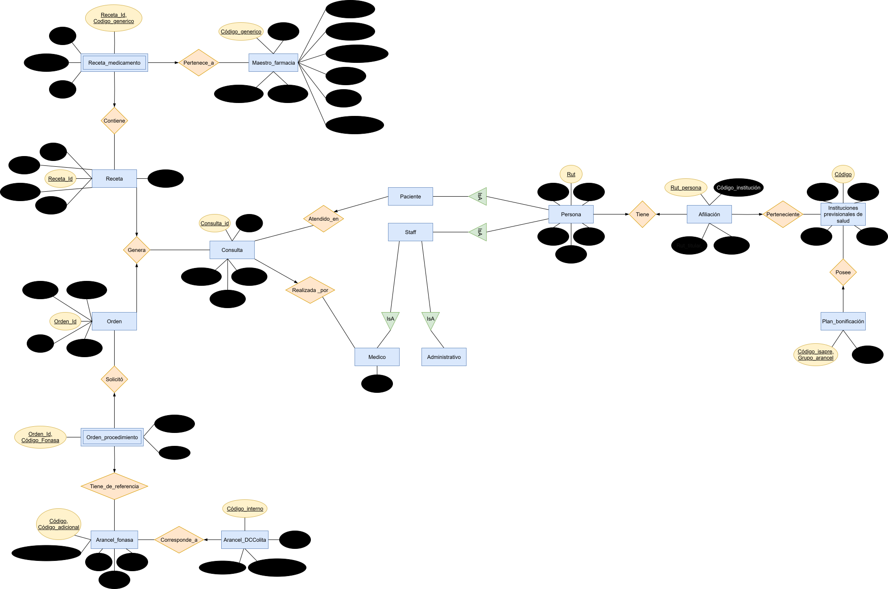

# Informe Entrega 1 - Bases de datos IIC2413

### Datos del Alumno
| **Apellidos**       | **Nombres**          | **Número de Alumno** |
|---------------------|----------------------|----------------------|
| Palomera Coccio     | Matias Felipe        |24664235              |

### 1. Modelo Entidad-Relación (E/R)
<!-- Inserta aquí tu diagrama ER. Usa el formato svg para evitar la perdida de calidad. Reemplaza "diagrama.svg" por la ruta a tu archivo -->

### 2. Entidades Débiles

#### 2.1 Receta_Medicamento
Se identifico **Receta_Medicamento** como entidad débil porque no existe sin una receta, su llave primaria esta compuesta por "Receta_Id" (proveniente de Receta) y "Codigo_generico"(proveniente de Maestro farmacia).

#### 2.2 Orden_procedimiento
Se identifico **Orden_procedimiento** como entidad débil porque no existe sin una orden, Su llave esta compuesta por "Orden_id" (proveniente de Orden) y "Codigo_fonasa"(proveniente de Arancel_FONASA).

### 3. Llaves Primarias  y Compuestas
<!-- Justifica TODAS las llaves: primaria simple y primaria compuesta -->
#### 3.1 Persona
La llave primaria de __Persona__ es  __Rut__ porque existe un rut unico por cada persona.

#### 3.3 Instituciones previsionales de salud
La llave primaria de __Instituciones previsionales de salud__ es  __Código__ porque tienen un código ministeriasl unico para Isapre/Fonasa.

#### 3.4 Maestro_farmacia
La llave primaria de __Maestro_farmacia__ es  __Codigo_generico__ porque es el codigo unico que se puede rescatar de la entidad. 

#### 3.5 Afiliacion
La llave primaria de __Afiliacion__ es __Rut_persona__ porque cada persona(conun Rut unico) puede tener a lo mas una afiliacion. 

#### 3.6 Arancel_DCColita
La llave primaria de __Arancel_DCColita__ es  __Código_interno__ porque es el identificador unico que se puede encontrar.

#### 3.7 Consulta
La llave primaria de __Consulta__ es  __Consulta_Id__ porque al nesecitar una llave, cree una llave ID para consulta.

#### 3.8 Receta
La llave primaria de __Receta__ es __Receta_ID__ porque al nesecitar una llave, cree una llave ID para consulta.

#### 3.9 Orden
La llave primaria de __Orden__ es __Orden_Id__ porque al nesecitar una llave, cree una llave ID para consulta.

#### 3.10 Receta_medicamento
La llave compuesta de __Receta_medicamento__ es (__Receta_Id__, __Codigo_generico__) porque es dependiente de "Receta" y "Maestro_farmacia".

#### 3.11 Orden_procedimiento
La llave compuesta de __Orden_procedimiento__ es (__Orden_Id__, __Codigo_fonasa__) porque es dependiente de "Orden" y "Arancel_fonasa".

#### 3.12 Arancel_FONASA
La llave compuesta de __Arancel_FONASA__ es (__Código__, __Código_adicional__) porque con ambos se define una unica prestacion.

#### 3.13 Plan_bonificacion
La llave compuesta de __Plan_bonificacion__ es (__Codigo_isapre__, __Grupo_arancel__) porque para cada institucion Isapre se define un porcentaje de bonificacion por grupo de aarancel.

### 4. Relaciones
<!-- Justifica TODAS las relaciones de tu modelo -->
#### 4.1 Atendido_en
Relaciona la entidad __Paciente__ y la entidad __Consulta__, porque cada paciente tiene que ser admitido en una consulta de un medico.

#### 4.2 Realizada_por
Relaciona la entidad __Medico__ y la entidad __Consulta__, porque Solo un medico le puede realizar consultas a un paciente.

#### 4.3 Tiene
Relaciona la entidad __Persona__ y la entidad __Afiliacion__, porque cada persona tiene una sola afiliacion a un seguro de salud.

#### 4.4  Perteneciente
Relaciona la entidad __Afiliacion__ y la entidad __Instituciones previcionales de salud__, porque una persona esta afiliada a una de las Instituciones almacenadas en Instituciones previcionales de salud.

#### 4.5 Genera
Relaciona la entidad __Consulta__ y la entidad __Receta__, porque una consulta se puede generar una receta de medicamentos.

#### 4.6 Genera
Relaciona la entidad __Consulta__ y la entidad __Orden__, porque una consulta puede generar una orden de procedimientos y examenes.

#### 4.7 Solicitó
Relaciona la entidad __Orden__ y la entidad __Orden_procedimiento__, porque Orden_procedimiento especifica los detalles de la orden.

#### 4.8 Tiene_de_referencia
Relaciona la entidad __Arancel_fonasa__ y la entidad __Orden_procedimiento__, porque cada procedimiento en la orden se referencia con un codigo Fonasa.

#### 4.9 Corresponde_a
Relaciona la entidad __Arancel_fonasa__ y la entidad __Arancel_DCColita__, porque un arancel interno puede estar vinculado a un arancel Fonasa.

#### 4.10 Contiene
Relaciona la entidad __Receta__ y la entidad __Receta_medicamento__, porque cada receta contiene uno o mas medicamentos.
 
#### 4.11 Pertenece_a
Relaciona la entidad __Receta_medicamento__ y la entidad __Maestro_farmacia__, porque cada registro de "Receta_medicamento" refiere a un medicamento existente en "Maestro_farmacia".

#### 4.12 Posee
Relaciona la entidad __Instituciones previsionales de salud__ y la entidad __Plan_bonificación__, porque relaciona cada isapre con los planes de bonificacion que posee definidos por grupo.

### 5. Cardinalidades
<!-- Explica la cardinalidad en CADA relación del modelo -->
#### 5.1 Persona - Afiliacion (1 -- 1)
- Una persona puede tener 0 o 1 afiliacion.
- Una afiliacion corresponde a exactamente una persona.

#### 5.2 Paciente - Consulta (N -- 1)
- Un paciente puede tener muchas consultas.
- Cada consulta corresponde a un unico paciente.

#### 5.3 Consulta - Medico (N -- 1)
- Un medico puede realizar muchas consultas.
- Cada consulta es realizada por un unico medico.

#### 5.4 Afiliacion - Instituciones previcionales de salud (N -- 1)
- Una institucion puede tener muchas afiliaciones.
- Una afiliacion corresponde a una unica institucn.

#### 5.5 Consulta - Receta (1 -- N)
- Una consulta puede generar una o mas recetas.
- Cada receta corresponde a una unica consulta.

#### 5.6 Consulta - Orden (1 -- N)
- Una consulta puede generar una o mas ordenes.
- Cada orden corresponde a una unica consulta.

#### 5.7 Orden - Orden_procedimiento (1 -- N)
- Una orden puede incluir uno o mas procedimientos.
- Cada Orden_procedimiento pertenece a una unica orden.

#### 5.8 Orden_procedimiento - Arancel_fonasa (N -- 1)
- Un procedimiento del Arancel_fonasa puede estar en muchas ordenes.
- Cada Orden_procedimiento corresponde a un unico procedimiento.

#### 5.9 Arancel_DCColita - Arancel_fonasa (N -- 1) 
- Un arancel interno puede corresponder a lo mas a un Arancel_fonasa.
- Un Arancel_fonasa puede ser referenciado por varios aranceles internos.

#### 5.10 Receta - Receta_medicamento (1 -- N)
- Una receta puede contener uno o mas medicamentos.
- Cada Receta_medicamento pertenece a una unica receta.

#### 5.11 Receta_medicamento - Maestro_farmacia (N -- 1)
- Un medicamento del Maestro_farmacia puede aparecer en muchas recetas.
- Cada Receta_medicamento corresponde a un unico producto.

#### 5.12 Instituciones previcionales de salud - Plan_bonificacion (1 -- N)
- Una institucion ISAPRE define multiples bonificaciones por grupo.
- Cada plan pertenece a una sola institucion.

### 6. Jerarquías
<!-- Identifica y justifica TODAS las jerarquías -->
#### 6.1 Persona - Paciente - Staff
Se modelo una jerarquía donde **Persona** es la entidad padre y **Paciente** y **Staff** heredan de ella, porque permite representar roles multiples de una persona, como medico que tambien puede ser paciente.

#### 6.2 Staff - Medico - Administrativo
Se modelo una jerarquía donde **Staff** es la entidad padre y **Medico** y **Administrativo** heredan de ella, porque garantiza la diferenciacion de funciones dentro del Staff mediante disyuncion (un staff no puede ser ambos).

### 7. Esquema Relacional
<!-- Construye el esquema relacional a partir de tu Modelo E/R -->

**Persona**( <u>rut</u>: VARCHAR, nombres: VARCHAR, apellidos: VARCHAR, telefono: INT, correo: VARCHAR, direccion: VARCHAR, profesion: VARCHAR )

**Medico**( profecion: VARCHAR )

**Instituciones previsionales de salud**( codigo: INT, nombre: VARCHAR, enlace: VARCHAR, rut: VARCHAR, tipo: VARCHAR ) 

**Afiliacion**( rut_persona: VARCHAR, codigo_institucion: INT, rut_titular: VARCHAR, tipo_afiliacion: VARCHAR )

**Plan_bonificacion**( codigo_isapre: VARCHAR , grupo_arancel: VARCHAR, porcentaje: INT )

**Maestro_farmacia**( codigo_generico: INT, descripcion_producto: VARCHAR, nombre_producto: VARCHAR, tipo_producto: VARCHAR, codigo_ONU: INT, clasificacion_ONU: VARCHAR, clasificacion_interna: VARCHAR, estado_codigo: VARCHAR, canasta_esencial: BOOLEAN, precio: INT )

**Arancel_FONASA**( codigo: INT, codigo_adicional: INT, consultas_y_atencion: VARCHAR, valor: INT, grupo: VARCHAR, tipo: VARCHAR )

**Arancel_DCColita**( codigo_interno: INT, codigo_fonasa: INT, consultas_y_atencion: VARCHAR, valor: INT )

**Consulta**( consulta_id: INT, fecha: DATE, diagnostico: VARCHAR, paciente_rut: VARCHAR, doctor_rut: VARCHAR )

**Receta**( receta_id: INT, fecha: DATE, diagnostico: VARCHAR, paciente_rut: VARCHAR, doctor_rut: VARCHAR, codigo_auth: VARCHAR )

**Orden**( orden_id: INT, fecha: DATE, diagnostico: VARCHAR, paciente_rut: VARCHAR, doctor_rut: VARCHAR )

**Receta_medicamento**( receta_id: INT, codigo_generico: INT, cantidad: INT, dosis: VARCHAR, observaciones: VARCHAR )

**Orden_procedimiento**( orden_id: INT, codigo_fonasa: INT, cantidad: INT, observaciones: VARCHAR )

### 8. Consistencia y Normalización en BCNF
- **Consistencia:** Cada relacion respeta las reglas del negocio DCColita de Rana que se pidieron. Por ejemplo, una consulta siempre tiene un paciente y un medico asociado, y una receta siempre se conecta con medicamentos del maestro farmacia. Esto significa que no es posible registrar una consulta sin doctor, ni una receta con un medicamento inexistente.
    
- **Normalización en BCNF:** Cada entidad tiene una llave principal que la identifica y todos los demas datos dependen de esa llave, esto evita prolemas como datos redundantes o innecesarios. 