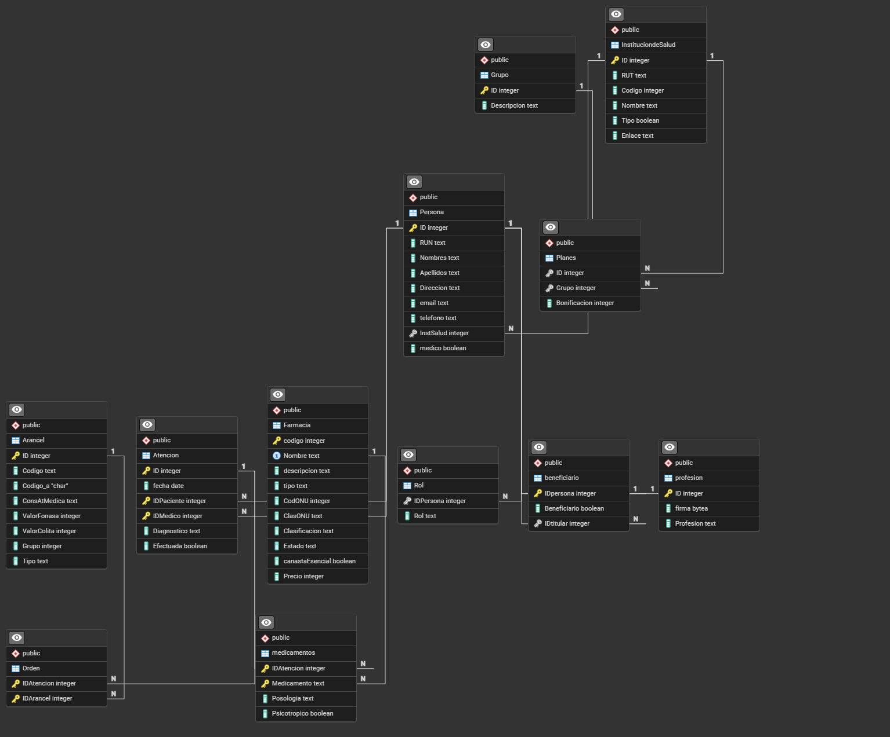

### 1. Esquema relacional de la Base de Datos

### 2. Listado de Archivos SQL y TXT

- **SQL:**
  - asistenciasperdidas.sql
  - beneficiariosnocliente.sql
  - beneficiariosporinstitucion.sql
  - ingresos.sql
  - ordenes.sql
  - recetas.sql
  - top5dx.sql
  - top5farma.sql
  - top5farmacia.sql
  - top5orden.sql

- **TXT:**
  - asistenciasperdidas.txt
  - beneficiariosnocliente.txt
  - beneficiariosporinstitucion.txt
  - ingresos.txt
  - ordenes.txt
  - recetas.txt
  - top5dx.txt
  - top5farma.txt
  - top5farmacia.txt
  - top5orden.txt

### 3. Mejoras al esquema de BD

- Problemas:
    1. Nombres inconsistentes
        - La mayoria de las tablas tienen la letra inicial en mayuscula ("`Arancel`"), pero luego existen tablas con nombres totalmente en minusculas ("`medicamentos`").
        - Habian atributos que eran poco descriptivos, como por ejemplo `Tipo` presente en `Arancel`, `Farmacia` y 
    2. No estan implementadas las boletas
        - No existe tabla dedicada a almacenar boletas
        - no hay registro de pagos realizados por los pacientes
- Soluciones:
    1. crear tablas para boletas y los pagos
        - Boleta(ID `INT`(PK), IDAtencion `INT`, FechaEmision `DATE`, Subtotal `INT`, Descuento `INT`, Total `INT`, Pagada `Bool`)
        - Pago(ID `INT`(PK), IDBoleta `INT`, FechaPago `DATE`, Monto `INT`)
    2. cambiar los nombres de las entidades y sus atributos
        - Por ejemplo: `InstituciondeSalud` --> `Institucion_Salud` o `institucion_salud`
        