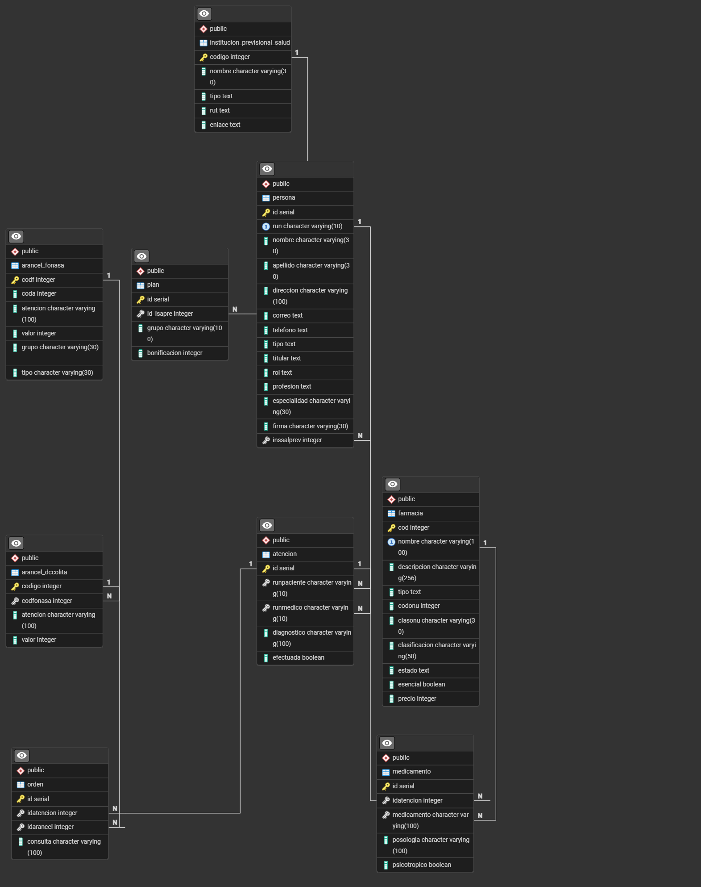

# Informe Entrega 3 - Bases de datos IIC2413

### Datos del Alumno
| **Apellidos**       | **Nombres**          | **Número de Alumno** |
|---------------------|----------------------|----------------------|
| Palomera Coccio | Matias Felipe    |24664235              |

### Esquema Base de Datos 



### Data cleaning en PHP
Hay datos que prefiero dejar en NULL a pesar de que dejarian la tupla basicamente inutilizable ya que pensando a futuro si quieren ingresar el dato valido correspondiente con el identificador de la tupla, se pueda añadir sin la nececidad de crear toda la tupla.

| Error.                 | Archivo   | Acción.      | Solución                                  |
|:-----------------------|:----------|:-------------|:------------------------------------------|
| correo con tildes.     | Persona   | corrección   | cambio de letra con tilde por sin tilde   |
|  ID faltante/invalido  | Persona, Plan, Atencion, Medicamento, Orden |  Eliminacion   | Eliminacion de la tupla completa      |
|  RUNs/RUTs invalido/faltante  | Ins_salud, Persona, Atencion  | Eliminacion    |  Eliminacion de la tupla completa    |
| Nombre faltante/invalido  | Persona, Ins_salud, Farmacia   |  Eliminacion   |  Eliminacion de la tupla completa     |
| Apellido faltante/invalido   | Persona   |  Eliminacion   | Eliminacion de la tupla completa      |
|  Codigo faltante/invalido  | A_DCColita, Ins_salud, Farmacia   | Eliminacion    |  Eliminacion de la tupla completa     |
|Codigo Fonasa faltante/invalido | A_Fonasa | Eliminacion|Eliminacion de la tupla completa |
| Descripcion faltante/invalida|Farmacia |Eliminacion |Eliminacion de la tupla completa |
|Clasificacion faltante/invalida |Farmacia | Eliminacion|Eliminacion de la tupla completa |
|Tipo invalido |Ins_salud, Persona, Farmacia |Corrección|normalizar las opciones y ver si cumple con las opciones validas, de lo contrario se deja NULL|
|enlace incompleto | Ins_salud|Corrección| se agrega <HTTPS//> para completar con el formato requerido|
|Correo invalido |Persona |Corrección| intentar arreglarlo mediante regex, de lo contrario dejar NULL|
| Telefono invalido| Persona|Corrección| verificar con regex, de lo contrario dejar 100000000|
| Titular invalido| Persona|Corrección|verificar con regex, de lo contrario dejar NULL|
|Rol invalido|Persona |Corrección| normalizar las opciones y ver si cumple con las opciones validas, de lo contrario se deja NULL|
|Profecion invalida|Persona |Corrección| normalizar las opciones y ver si cumple con las opciones validas, de lo contrario se deja NULL|
|Codigo adicional invalido|A_Fonasa |Corrección|verifica si es un numero, de lo contrario cambia a NULL |
|Bonificacion fuera de rango/invalida |Plan |Corrección|verifica si es un entero, positivo perteneciente a [0, 100], de lo contrario se cambia a 0 |
|Codigo ONU invalido| Farmacia|Corrección|verifica si es un numero, de lo contrario cambia a NULL |
|Estado invalido |Farmacia |Corrección| Se cambia a NULL|
| esencial invalido| Farmacia|Corrección |Verifica si es 0 o 1, en el caso contrario lo deja en NULL |
|Valor/Precio invalido | A_Fonasa, Farmacia, A_DCColita|Corrección|Se verifica si es un entero, en el  caso contrario se cambia a NULL |
|Efectuada invalida|Atencion |Corrección|Verifica si es un bool, en el caso contrario deja en NULL |
| Psicotropico invalido|Medicamento |Corrección|Verifica si es un bool, en el caso contrario deja en NULL |
|Consulta, Posologia, Diagnostico, Atencion, ClasOnu, Grupo, tipo, atencion, firma, especialidad, direccion | Persona, A_Fonasa, Plan, Farmacia, A_DCColita, Atencion, Medicamento, Orden|Corrección|Se verifica si no contiene caracteres especiales, si cumple con el limite de caracteres y si la forma en las que estan escritos cumple con el contexto |


Indicar los registros con correos con tildes

### Instrucciones de ejecución de Entrega
Para ejecutar el main.php y carga.sql, se espera que los archivos estén ubicados en una estructura como esta:
```
.
│   
└── E3/
    ├── firmas/
    │   └── *files
    ├── planes/
    │   └── *.csv
    ├── *.csv
    ├── carga.sql
    ├── main.php
    └── README.md
```
Al ejecutar `php main.php` se creará la carpeta /outputs, en el caso de que se quiera VOLVER A EJECUTAR main.php, se tiene que borrar manuelmente la carpeta /outputs.  
Despues de la ejecución quedaría asi:
```
.
│   
└── E3/
    ├── firmas/
    │   └── *files
    ├── outputs/
    │   ├── dircsv/
    │   │   ├── fileERR.csv
    │   │   ├── fileLOG.txt
    │   │   └── fileOK.csv
    │   ├──...
    │   ...
    ├── planes/
    │   └── *.csv
    ├── *.csv
    ├── carga.sql
    ├── main.php
    └── README.md
```

### 4. Observaciones adicionales
A partir de esta issue:  
```
**Subir los archivos al server Issues 106**  
└──  Se deben subir los archivos .csv al servidor
```
Subi los archivos .sql originales  
  
    
modelo.png es la imagen del modelo para la 1.